[toc]

# CH3 数据和信号

物理层通过传输介质以电磁信号的形式传输**数据**。

**数据要进行传输，必须将其转换为电磁信号**

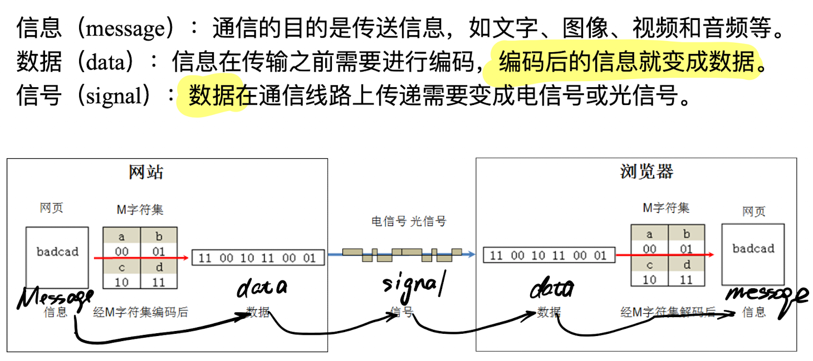

## 模拟和数字

**数据和信号**可以是模拟analog的，也可以是数字digital的

+ 数据可以是模拟的也可以是离散的
  + 模拟数据是连续的，采用连续值
  + 数字数据有离散状态，采用离散值
+ 信号signal可以是模拟的也可以是数字的
  + 模拟信号在一定范围内有无穷多个值
  + 数字信号只能有有限个数值

## 周期信号和非周期信号

模拟和数字信号有两种形式

+ 周期信号 periodic signal
+ 非周期信号 nonperiodic signal

往往使用**周期模拟信号**和**非周期数字信号**

+ 周期模拟信号：需要更少的带宽（CH5）
+ 非周期数字信号：可以表示数据的变化

## 周期模拟信号

+ 简单类型： 正弦波sine wave
+ 复合类型：多个正弦波信号组成

### 正弦波

由以下三个参数决定

+ 峰值振幅 peak amplitude
+ 频率 frenquency
+ 相位 phase

#### 峰值振幅

最高强度的绝对值，单位v，伏特

#### 周期和频率

$$
f=\frac{1}{T}
$$

频率单位Hz。

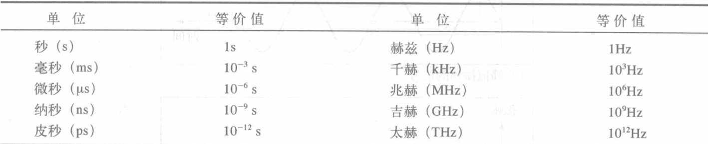

如果信号在短时间内发生变化，则频率高，否则频率低

**两个极端**

+ 信号持续不变化：频率是0
+ 瞬间变化：频率无穷大。

#### 相位phase

波形相对于时间0的位置

#### 波长wavelength

一个简单信号在一个周期能传播的距离
$$
波长=传播速度\times 周期
\\
\lambda=\frac{c}{f}
$$

#### 时域和频率

**时域图time-domian plot**显示了信号振幅随时间的变化。

为了表示振幅与频率的关系。可以用**频域图frequency-domain plot**

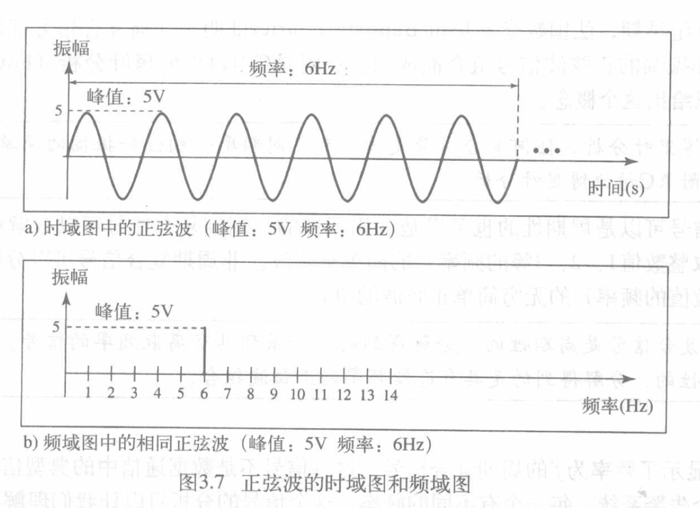

单个峰值，表示一个完整的正弦波

### 复合信号

**复合信号composite signal**由许多正弦波构成

> 单一正弦波在数据通信中没有用户，我们需要发送复合信号，复合信号由许多简单正弦波组成

**傅里叶分析：任何符合信号都是由具有不同频率、相位和振幅的正弦波信号组合而成的**

#### 周期复合信号

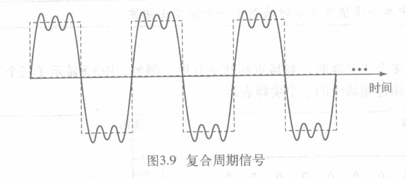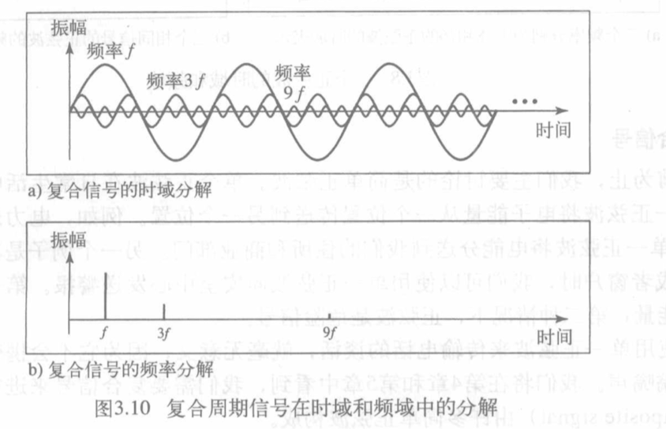

f: 第一谐波；3f: 第三谐波；9f：第九谐波

#### 非周期复合信号

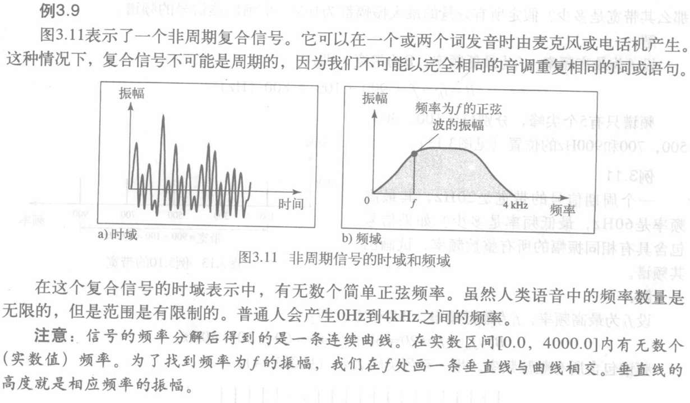

### 带宽bandwidth

复合信号包含的频率范围称为带宽

通常是两个数的差值。如果一个复合信号包含1000到5000的频率，那么带宽就是4000

> 最高频率-最低频率

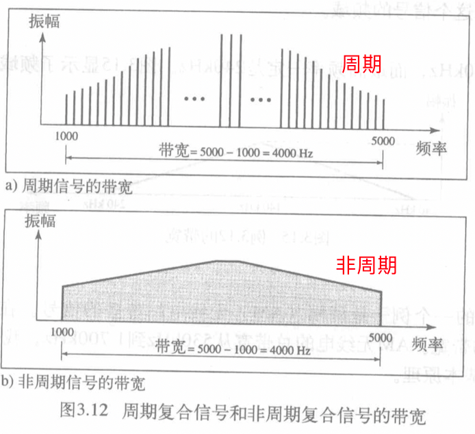

#### 例子

**周期复合信号**

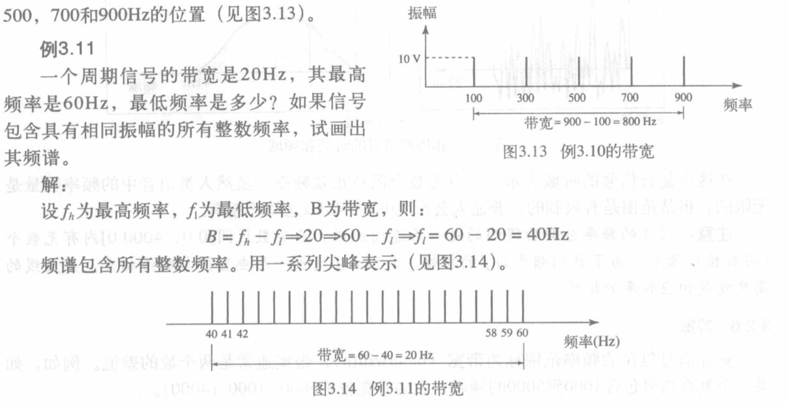

**非周期复合信号**

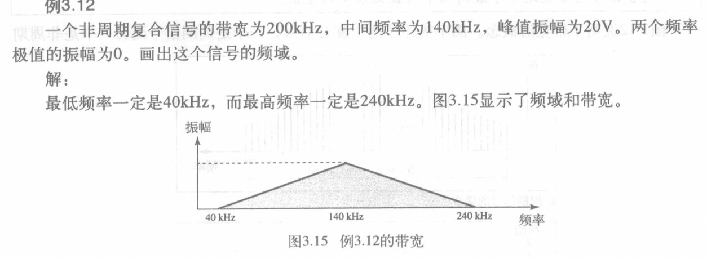

**调幅AM和调频FM**

后面会说

**黑白电视**

电视屏幕像素组成。白或黑。

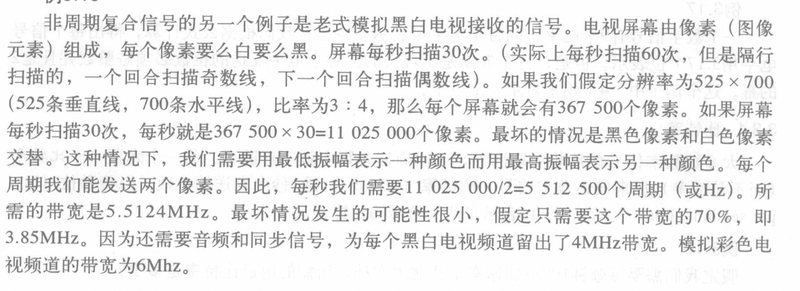

## 数字信号

数据可以用数字信号表示。1编码为正电平，0编码为0电平。

一个电平也可以表示为多个位。比如，四个电平情况下，一个电平表示两位

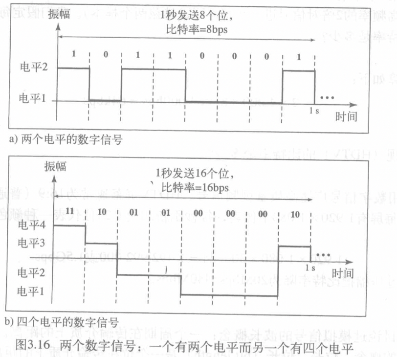

> 信号有L个电平，则每个电平表示$\log_2^L$个位

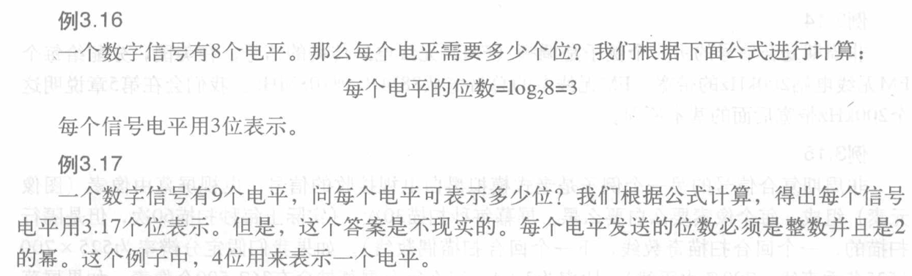

### 比特率 bit rate

1秒发送的位数，单位bps

🌰

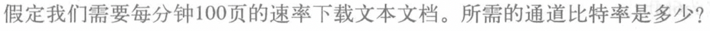
$$
100\times 24\times 80\times 8 /60=256\text{kbps}
$$

### 位长 bit length

一个**位**在传送介质上的距离
$$
位长=传播速度\times位持续时间
$$

### 数字信号是一种复合模拟信号

基于傅里叶分析，数字信号是复合模拟信号。**带宽无穷大**

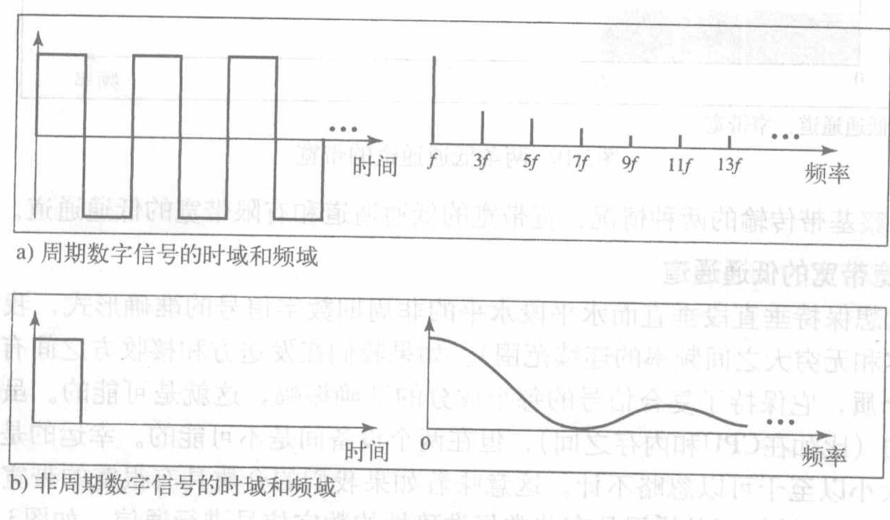

### 数字信号的传输

数字信号由0到无穷大的频率组合成的**复合模拟信号**。

两种不同的方法创术数字信号：

+ 基带传输
+ 宽带传输

#### 基带传输baseband

通过通道发送数字信号。该信号**不转换成模拟信号**。

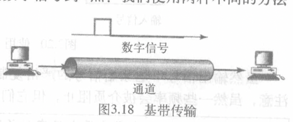

+ 需要一个下限是0的低通通道low-pass band
+ 有低通通道就可以进行**基带传输**

有两种情况

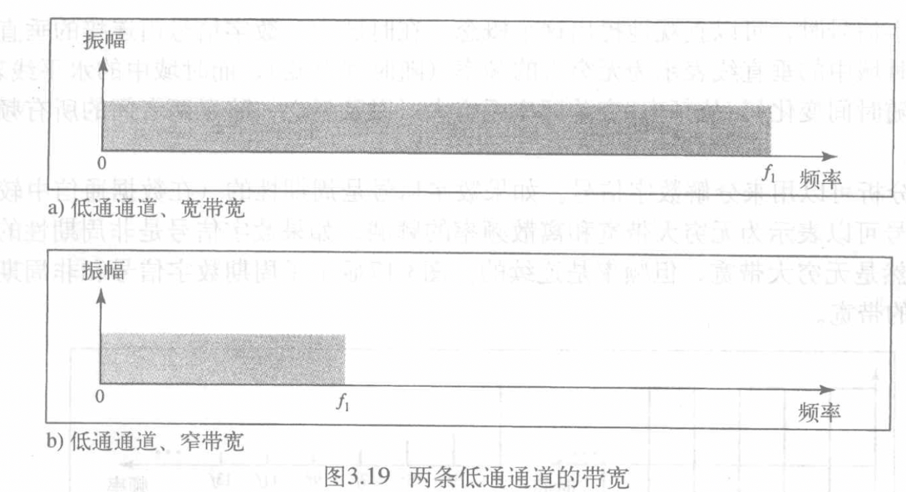

+ 宽带宽
+ 宽带窄

##### 宽带宽

+ 如果真想保持**垂直段垂直，水平段水平**，则需要发送整个频谱。
+ 如果真的有一个无穷大带宽的介质，是有可能实现的。
+ 但是实际上，频谱边界的频率振幅过小以致于可以忽略不计
+ 只要介质有足够宽的带宽，就可以保留很好地准确性进行通信

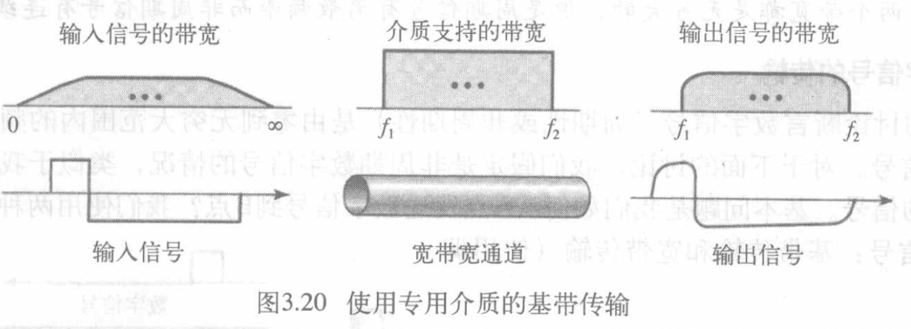

##### 有限宽带

**将数字信号近似为模拟信号**

**大致近似**

假定数字信号bit rate=N

+ 考虑最坏情况：01010101,10101010，这种情况下频率最高$f=\frac{N}{2}$。使用该频率的模拟信号
+ 考虑3位的情况
  + 000,111.频率=0
  + 101,010，频率=$\frac{N}{2}$
  + 011，100，001，110：$f=\frac{N}{4}$
+ 第一谐波：$f=\frac{N}{2}$

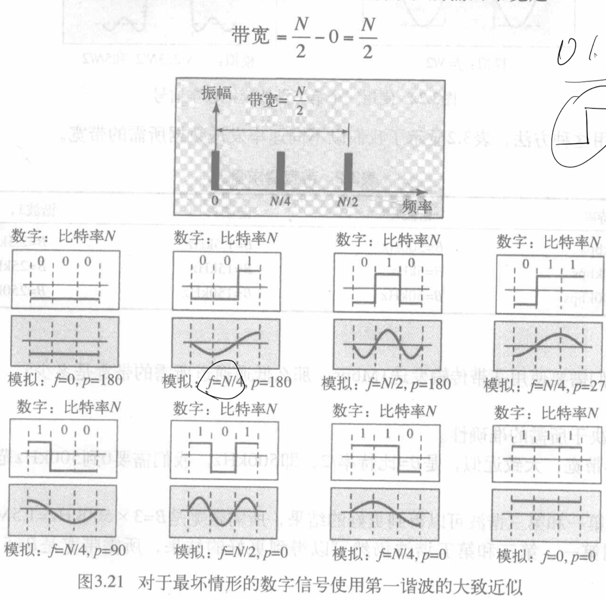

**更好近似**

增加频率的更多谐波。

> 基带传输中，带宽与比特率成正比，如果我们需要更快发送位，需要更大的带宽

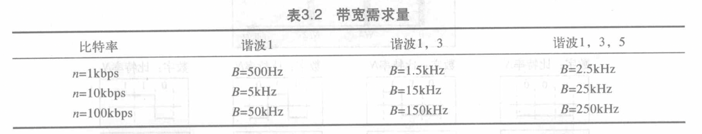

**🌰如果我们需要用基带传输发送1Mbps，那么低通通道需要的带宽是多少？**

答：取决于准确性：

1. 最小带宽，大致近似：$B=\frac{bit \quad rate}{2}$
2. 第一谐波+第三谐波：$B=3\times{\text{500kHz}}=1.5MHz$
3. 1+3+5：$B=5\times\text{500kHz}=2MHz$

#### 宽带传输（使用调制）

**宽带传输或调制就是把数字信号转换成模拟信号传输**，调制允许我们使用**带通通道bandpass channel**

+ 带宽不从0开始
+ 比低通通道更可用

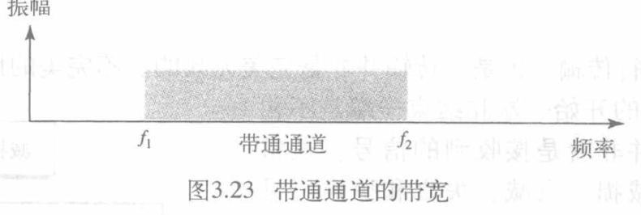

🌰

通过电话线传输计算机数据。电话用户线连接住所到中心电话局。使用有限带宽（0~4kHz）。一般把它看做带通通道，

1. 计算机把数字信号转换成模拟信号
2. 发送模拟信号
3. 安装两个转换器
   1. 发送端把数字信号转换成模拟信号
   2. 接收端反之
4. 转换器称为**调制解调器**

🌰数字蜂窝电话

+ 数字蜂窝电话把模拟信号转换成数字信号
+ 主叫方和被叫方之间只有一条带通通道
  + 有效带宽是M
  + 如果有1000人同时交谈
  + 一次通话的有效带宽是$\frac{W}{1000}$
+ 所以必须把数字信号转换成复合模拟信号
  + 数字蜂窝电话把模拟音频信号转换成数字信号
  + 再把数字信号转换成模拟信号通过带通通道传输

### 传输减损

通常有三种类型的减损：衰减、失真和噪声

+ 衰减attenuation
+ 失真distortion
+ 噪声noise

#### 衰减 attenuation

意味着能量的损失，一部分能量转换为热能。

**解决方法**

使用放大器amplifier放大信号

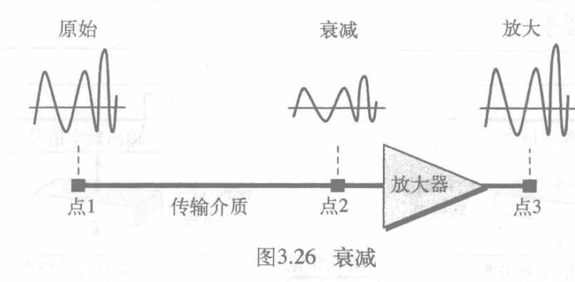

**分贝dB**

工程上用于计算两种信号之间相对强度。若信号衰减，则分贝为负值
$$
dB = 10 \log_{10}\frac{P_2}{P_1}
$$
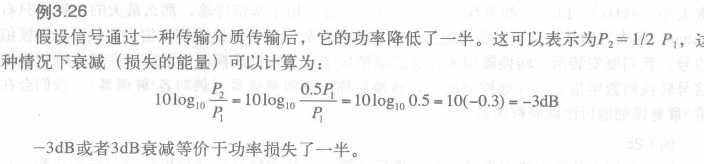

#### 失真distortion

信号改变了形态或形状

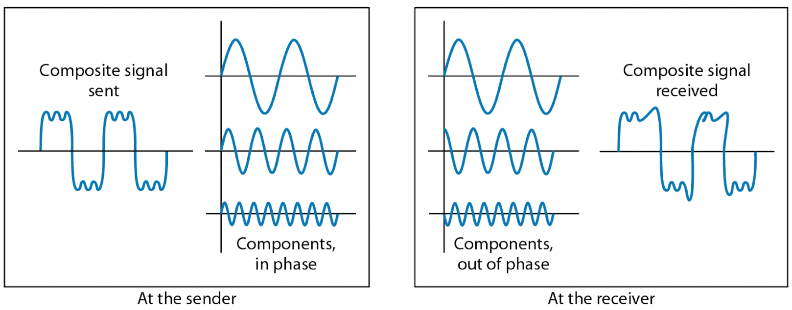

#### 噪声noise

热噪声、感应噪声、串扰和脉冲噪声

**信噪比SNR**

signal-to-noise ratio
$$
SNR=\frac{平均信号功率}{平均噪声功率}
$$
我们需要考虑平均信号功率和平均噪声功率。因为他们会随时间变化

可以用分贝描述，$SNR_{dB}$定义如下
$$
SNR_{dB}=10log_{10}SNR
$$
🌰

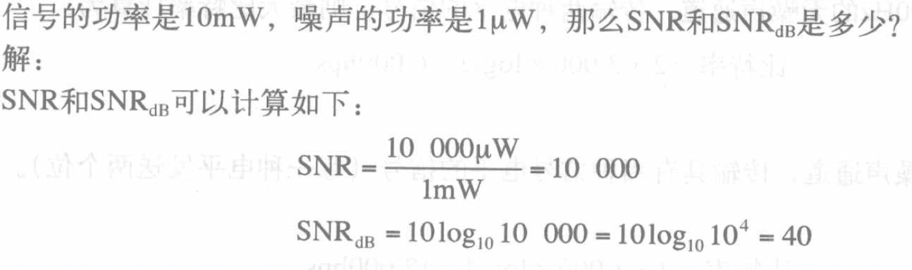

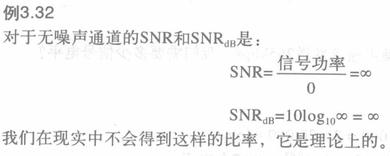

## 数据速率限制

数据速率取决于三种因素

+ 有效带宽
+ 使用的信号电平
+ 通道的质量（噪声的电平）

两个公式

+ 奈奎斯特：无噪声通道
+ 香农定理：噪声通道

### 无噪声通道奈奎斯特公式

Nyquist bit rate
$$
bit rate = 2\times 带宽 \times \log_2L
$$
带宽：通道带宽

L：同于表示数据的信号电平数量

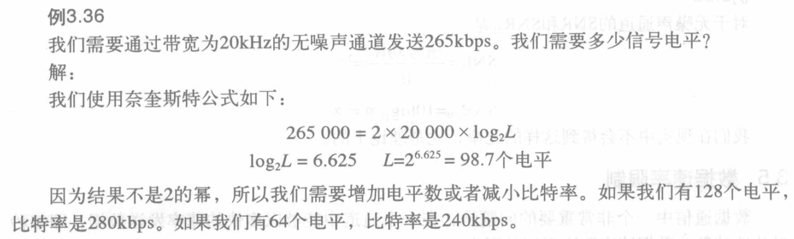

### 噪声通道：香农容量定理

Shannon Capacity噪声通道理论上最高数据速率
$$
通道容量=带宽\times \log_2{(1+SNR)}
$$
通道容量：通道的传输容量，每秒的比特数

**极端情况SNR$\rarr0$**
$$
C=B\log_2 (1+SNR)=B\times0=0
$$
与带宽无关。bit rate = 0

**🌰**

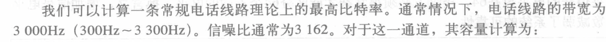
$$
B=3000Hz\\
SNR=3162\\
C=B\log_2 (1+SNR)=3000\times \log_2 3163
$$
🌰

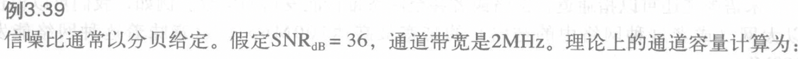
$$
SNR_{dB}=36\\
SNR=10^{3.6}\\
B=2\times 10^6Hz\\
C=2\times{10^6}\times\log_2(10^{3.6}+1)
$$

## 性能

### 带宽

#### 以Hz衡量带宽

复合信号包含的频率范围或通道能通过的频率范围

#### 以每秒比特数衡量的带宽

100Mbps

通道或链路中**位**传输的速率

### 吞吐量

throughput用来衡量通过网络发送数据的快慢

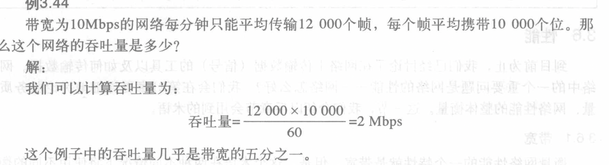

### 延迟

**从源开始发出到整个报文完全到达目标的时间**

+ 传播时间propagation time
+ 传输时间transmission time
+ 排队时间queuing time
+ 处理延迟processing delay

延迟=传播时间+传输时间+排队时间+处理延迟

#### 传播时间propagation time

$$
传播时间=\frac{距离}{传播速度}
$$

#### 传输时间 transmission time

$$
传输时间=\frac{报文长度}{带宽}
$$

### 带宽时延积

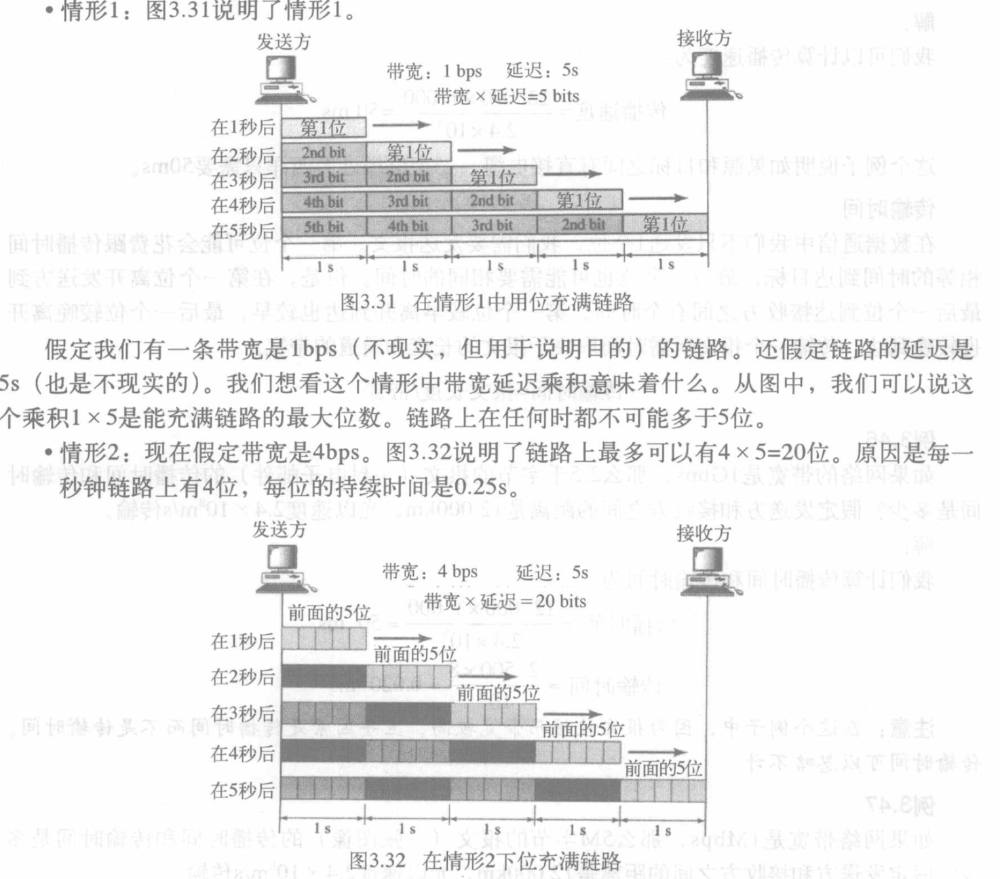

带宽时延积是能充满链路的位的个数。

为了使用链路的最大容量，我们需要脉冲长度是带宽和延迟乘积的二倍（充满全双工通道）

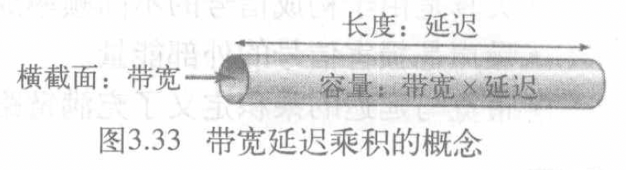

