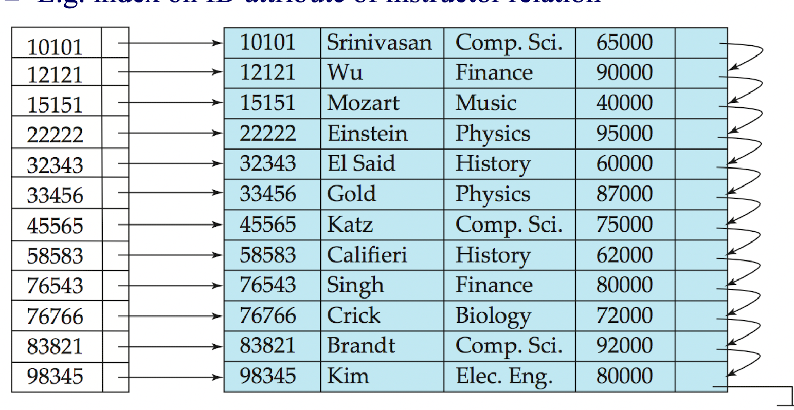
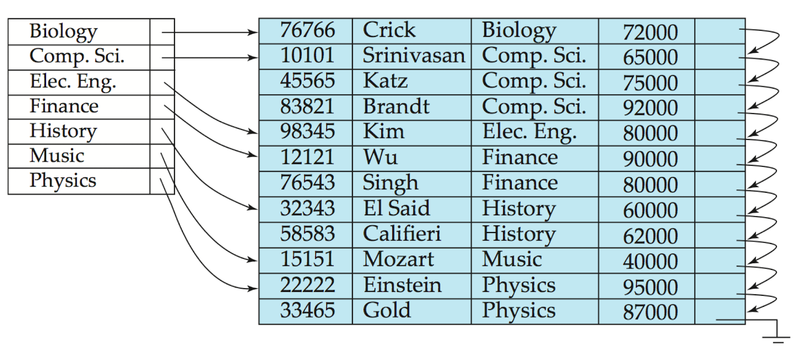
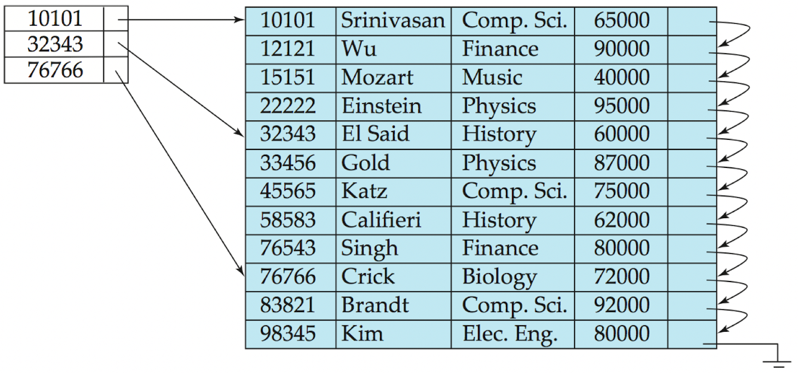
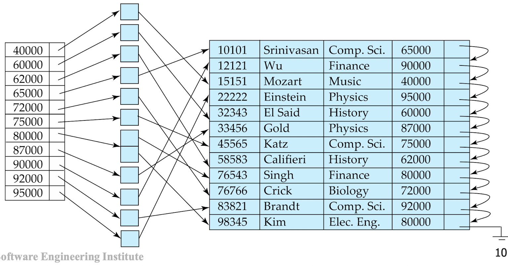
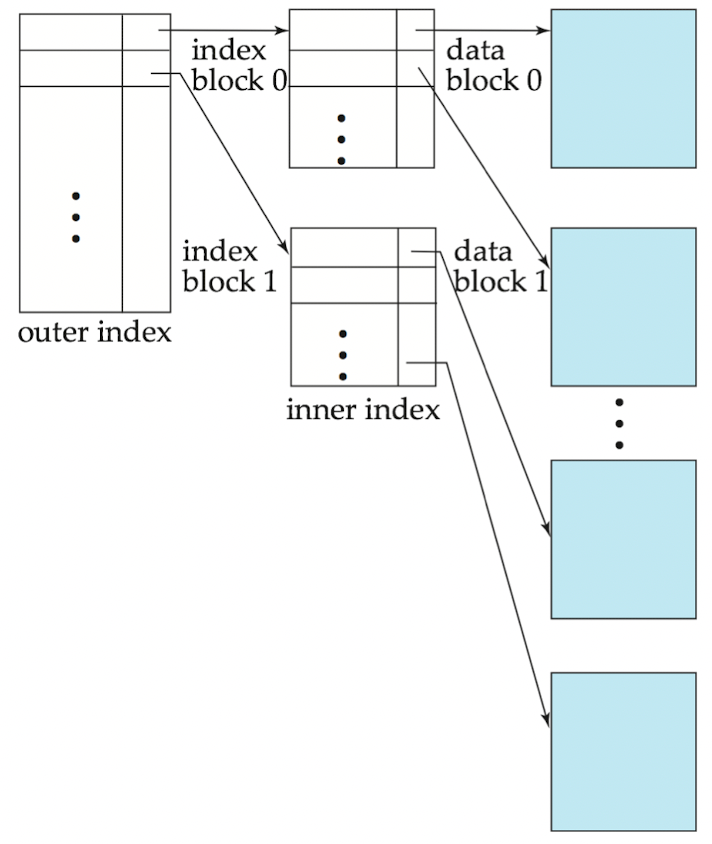
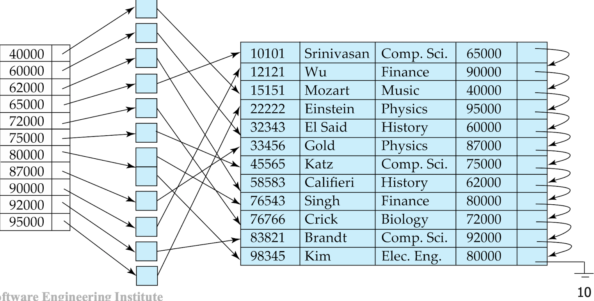
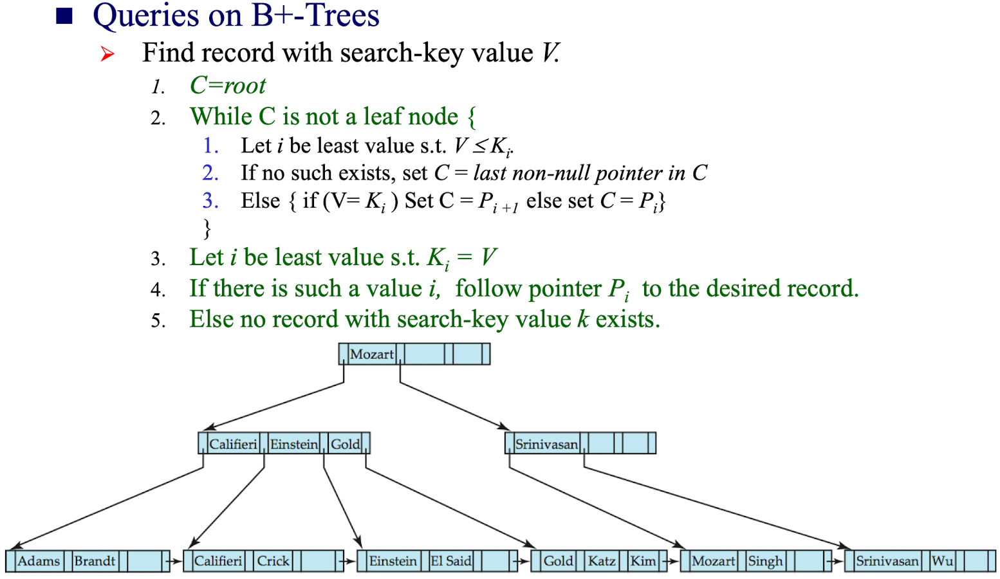
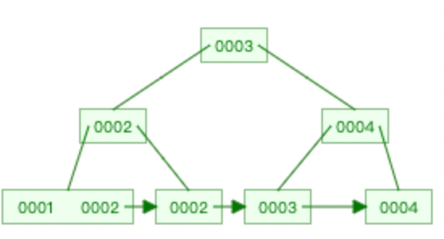
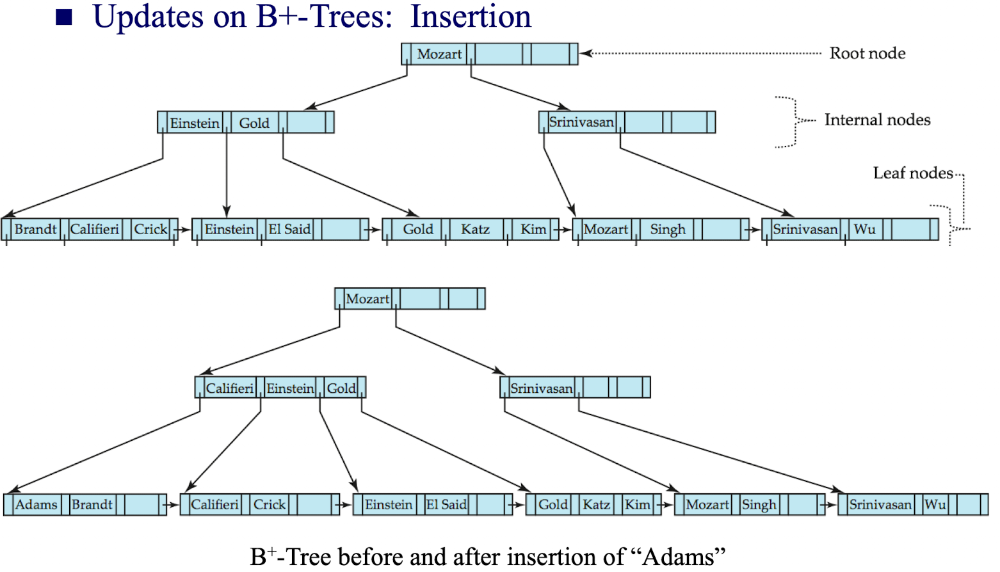

# CH11

> 不考大题，考选择

## 基本概念

+ 索引机制用来加速访问数据

+ **Search key搜索码：**索引文件中用来查找记录的属性或属性集

+ **index file: **索引文件由**index entries索引项**组成

  

+ 索引文件一般比普通文件小很多

+ 两种索引

  + 顺序索引 ordered indices：**搜索码**按顺序存储
  + 哈希索引 hash indices：**搜索码**使用哈希函数hash function均匀分布在桶buckets中

### 索引评估指标 evaluation metrics

+ 访问类型 access type：能有效支持的访问类型
+ 访问时间 access time: 在查询中使用该技术找到一个特定数据项或数据项集所需的时间
+ 插入时间 insertion time: 插入一个新数据项所需的时间
+ 删除时间 deletion time
+ 空间开销 space overhead

## 顺序索引

### clustering index/primary index

聚集索引/主索引

搜索码一般是主码，有时也不是。

### non-clustering index/secondary index

搜索码指定的顺序与文件中记录的物理顺序不同的索引。

### 索引顺序文件

## 稠密dense索引和稀疏sparse索引

+ **稠密索引 dense index**

  + 在稠密聚集索引中，
    + 文件中的**每个搜索码值**都有一个索引项。
    + 索引项包括
      + 搜索码值
      + 指向具有该搜索码值的**第一条数据记录的指针**
  + **稠密非聚集索引**
    + 索引必须存储指向所有具有相同搜索码值的记录的指针列表
    + 只包含某些搜索码值

  

+ **稀疏索引 sparse index**：只为搜索码的某些值建立索引项

  + 必须是聚集索引

To locate a record with largest search-key value<K

Search file sequentially starting at the record to which the index record points.

1. 找到块的第一个搜索码（找到记录中小于该搜索码的最大搜索码Find index record with search-key value<K）
2. 从这个index record所指的文件记录开始顺序搜索

### dense和sparse的比较

+ 更少的空间和插入删除的维护开销
+ sparse可以指向data block的第一个

### 辅助索引 secondary indices

+ Index record points to a buckert that contain pointers to all the actual records with that particular search-key value.
+ 必须是dense index

### 聚集索引和辅助索引

为记录搜索提供了实质性的好处但是

+ 数据库被修改，每个索引都要更新。
+ 使用聚集索引进行顺序扫描很高效，但是在辅助索引上使用顺序扫描消费很高
  + 每个记录有可能在磁盘的新块中

## 多级索引

把primary index当做一个磁盘上的顺序存储文件，在它上面构建索引。

+ outer index——聚集索引的稀疏索引
+ inner index——聚集索引文件

## 索引更新：删除

+ 如果删除的记录是文件中唯一的记录，则搜索码从索引中删除
+ （单层single-level）索引项删除
  + 稠密索引：搜索码的删除类似文件记录的删除
  + 稀疏索引：
    + 如果搜索码在索引中存在索引项，则用下一个搜索码替代
    + 如果下一个搜索码有索引项，则原索引项删除

## 索引更新：插入

### 单层索引

+ 稠密索引：如果搜索码在索引中没有，则插入一个
+ 稀疏索引：如果如果索引存储了文件的所有块，则不需要改变任何索引；如果**创建了新块，则需要更新索引——将新块的第一个搜索码插入到index中**

### 多层索引的插入和删除

单层索引的简单扩展

## 辅助索引

如果搜索码是非候选码，连续值可能不是连续存放的。则可以用辅助索引。

## B+树🌲

### 背景

#### 索引顺序文件的缺点

+ 随着文件的增大，索引性能会下降，因为会创建溢出的块
+ 需要定时重组文件

#### B+树索引文件的优点🌲

+ 在插入和删除时，面对小的局部的修改可以自动重组。
+ 不需要重组文件来维护性能

#### B+树缺点

额外的插入和删除性能开销和空间开销

### 定义

满足如下条件

+ 从root到所有叶子节点的长度一致
+ 每个非根节点或非叶子结点含有$\lceil n / 2\rceil 到 n$个孩子结点
+ 叶子节点包含$\lceil (n-1) / 2\rceil 到 n-1$个值
+ 如果子节点不是叶子，至少有两个孩子
+ 如果子节点是叶子，可以有0~（n-1）个值

### 查询

### 处理重复 handling duplicates

如果存在重复的搜索码

+ 在叶子和内部节点
  + 不能保证$K_1<K_2<K_3<...K_{n-1}$
  + 但是可以保证$K_{1} \leq K_{2} \leq K_{3} \leq \ldots \leq K_{n-1}$
+ $P_i$指向的子树
  + 均$\leq K_i$，但是不一定都小于$K_i$
  + 假设搜索码V在两个叶子节点$L_i$和$L_{i+1}$中都有，那么父节点$K_i$一定等于V

#### 查询方法

+ 即使$V=K_i$，也遍历$P_i$

  

+ 到达叶子节点后，检查C是否值都小于V

  + 是则令C等于C的右兄弟

### 插入操作

1. 找到搜索码应该出现的叶子节点
2. 如果搜索码已经有了
   1. 向文件中添加记录
   2. 如果需要，向桶中添加指针
3. 如果没有
   1. 2.a 2.b
   2. 如果叶子结点还有空间，则直接把键值对插入到叶子结点
   3. 否则，分裂节点

### 分裂的方法

1. 对节点按顺序排列，把前$\lceil \frac{n}{2} \rceil$个键值对放到原始节点中，剩下的放到新节点中
2. 新节点为p，令k为p中最小搜索码。把（k,p)**插入（insert）**到父节点

最差情况下，有可能根节点需要进行分裂，进而使高度+1

### 如果一个非叶子节点已经满了

看PPT和书吧。太理解性了

